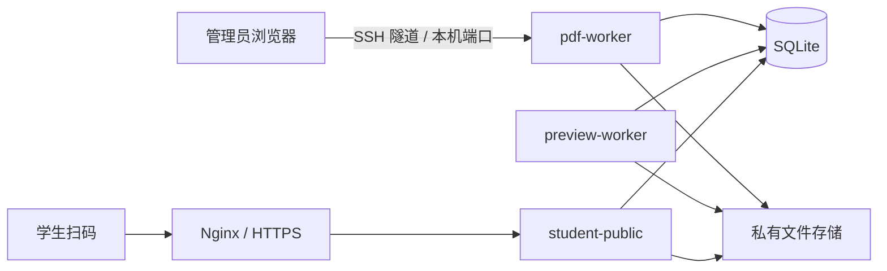

# QRPDF — 练习册永久二维码与在线解析系统

[中文](#中文说明) | [English](#english)

## 中文说明

### 项目用途

QRPDF 是一套面向教师、教辅机构和内容管理员的自托管系统。管理员上传解析 PDF 后，系统按文件名建立资料并生成永久二维码；二维码可以印在练习册上，学生扫码后在网页中逐页查看带水印的解析内容。

同名 PDF 再次上传时会更新原资料，但永久二维码保持不变。新文件处理失败时，已发布的旧内容继续可用，不会让已印刷二维码失效。

当前数据库版本为 Schema 8。

### 主要能力

- 单份或批量上传 PDF，文件名自动成为资料名。
- 新资料立即预留永久二维码；处理中扫码会显示等待页面。
- 同名 PDF 原子更新，成功后切换内容，失败时保留旧版本。
- 把已有永久二维码添加到练习册 PDF，并下载处理后的 PDF。
- 学生端按页显示 WebP 预览，支持服务端动态水印、会话过期和限速。
- 管理端与学生端分离；公网学生服务不包含后台、管理 API 或原件接口。
- 管理员密码和永久删除二级密码可在后台“安全设置”中修改。
- SQLite 自动迁移、迁移前备份、审计事件、备份和恢复脚本。

### 运行环境

推荐环境：

- Linux x86-64/ARM64 服务器；
- Docker Engine 24+；
- Docker Compose v2；
- Python 3.11+（只供部署、备份和维护脚本使用）；
- 2 CPU、至少 2 GiB 内存、10 GiB 以上可用磁盘；
- 正式扫码环境需要稳定域名、HTTPS 和正确的 DNS/备案配置。

开发环境也可以使用 Windows + Docker Desktop。生产环境建议让管理端口只监听 `127.0.0.1`，管理员通过 SSH 隧道访问；公网只由 Nginx 代理 `student-public`。

### 架构



| 组件 | 用途 | 是否对公网开放 |
| --- | --- | --- |
| `pdf-worker` | FastAPI 管理后台、管理 API、PDF 合成、数据库迁移 | 否，默认仅回环地址 |
| `preview-worker` | 后台处理批量上传、校验 PDF、生成分页 WebP 预览 | 否，无端口 |
| `student-public` | `/q`、兼容 `/r`、学生预览页和健康检查 | 通过 Nginx/HTTPS 开放 |
| Nginx | TLS 终止、学生路由反向代理、阻断管理路径 | 是 |
| SQLite | 资料、版本、二维码、任务、会话、审计和网页密码哈希 | 否 |
| 本地存储 | 原始 PDF、预览页、二维码 PNG、生成后的练习册 | 否 |
| `quickdrop` | 独立的可选文件投递服务，业务系统不依赖它 | 默认否 |

### 目录与文件说明

| 路径 | 作用 |
| --- | --- |
| `.env.example` | 可提交的环境变量模板；真实 `.env` 不进入 Git |
| `compose.yaml` | Docker Compose 服务、网络、端口、卷、资源和安全限制 |
| `scripts/deploy.sh` | 从零初始化配置、构建镜像并启动核心服务的一键脚本 |
| `scripts/configure_deployment.py` | 校验公开地址并原子生成 `.env`、随机密钥和一次性管理员密码 |
| `scripts/backup_stage05.sh` | 使用 SQLite Backup API 和文件校验生成整套业务备份 |
| `scripts/restore_stage05.sh` | 校验备份、演练恢复或在明确确认后正式恢复 |
| `deploy/nginx/qrpdf-http.conf` | 公网学生入口的通用 Nginx 模板；使用前替换示例域名 |
| `docs/USER_GUIDE.md` | 中英双语管理员用户手册 |
| `docs/DEPLOYMENT.md` | 中英双语从零部署、HTTPS、更新、备份和故障排查文档 |
| `docs/stage_*.md` | 各阶段设计、迁移、测试和历史决策记录 |
| `pdf-worker/Dockerfile` | Python 运行镜像、测试镜像和非 root 运行用户 |
| `pdf-worker/requirements*.txt` | 运行依赖与测试依赖的固定版本 |
| `pdf-worker/app/main.py` | 创建管理应用与公网学生应用，注册中间件和服务 |
| `pdf-worker/app/config.py` | 环境变量解析、默认值和配置校验 |
| `pdf-worker/app/database.py` | Schema 定义、SQLite 连接、版本迁移和迁移前备份 |
| `pdf-worker/app/admin/routes.py` | 登录、资料管理、批量上传、PDF 工具、删除和安全设置页面路由 |
| `pdf-worker/app/routers/` | 健康检查、学生访问、兼容跳转和管理 API 路由 |
| `pdf-worker/app/services/` | 资料、版本、二维码、预览、PDF、水印、会话、删除、密码等业务逻辑 |
| `pdf-worker/app/storage/` | 私有文件存储接口及本地文件系统实现 |
| `pdf-worker/app/templates/` | 管理端和学生端 Jinja2 HTML 模板 |
| `pdf-worker/app/static/` | 管理端和学生端 CSS/JavaScript |
| `pdf-worker/app/preview_worker.py` | 后台 Worker 进程入口 |
| `pdf-worker/app/scripts/` | 回填、清理、审计、负载和恢复演练工具 |
| `pdf-worker/scripts/` | 密码初始化、数据库备份和迁移检查工具 |
| `pdf-worker/tests/` | 单元、集成、迁移、安全和工作流测试 |
| `data/` | 运行时数据库和文件，已被 Git 忽略，绝不能随意删除 |

### 快速部署

在一台已安装 Docker、Docker Compose 和 Python 3 的 Linux 服务器上执行：

```bash
git clone <repository-url> qrpdf
cd qrpdf
chmod +x scripts/deploy.sh
./scripts/deploy.sh --public-url https://qr.example.com
```

脚本会生成 `.env`、安全随机密钥和一次性管理员密码文件，构建镜像并启动 `pdf-worker`、`preview-worker` 和 `student-public`。它不会自动修改 DNS、申请证书或把管理端暴露公网。

部署完成后，立即读取并安全保存 `.initial-admin-password`，登录成功后删除该文件：

```bash
cat .initial-admin-password
rm .initial-admin-password
```

完整步骤见 [部署文档](docs/DEPLOYMENT.md)。

### 常用维护命令

```bash
docker compose ps
docker compose logs --tail=100 pdf-worker preview-worker student-public
curl -fsS http://127.0.0.1:18081/health
curl -fsS http://127.0.0.1:18082/health
```

运行当前产品契约的核心测试：

```bash
docker compose --profile test build pdf-worker-tests
docker compose --profile test run --rm pdf-worker-tests \
  python -m pytest -q \
  tests/test_admin_auth.py \
  tests/test_security_settings.py \
  tests/test_stage06_batch_and_deletion.py \
  tests/test_permanent_qr_upload.py
```

部分早期测试保留了已经下线的 TXT/图片上传、固定版本二维码和旧资料字段契约，维护时应区分“历史兼容测试”和“当前产品契约”，不要为了旧测试恢复已经主动删除的产品能力。

### 数据与安全

- 数据库：`data/pdf-worker/db/app.db`
- 数据库迁移备份：`data/pdf-worker/db/backups/`
- 私有文件：`data/pdf-worker/storage/`
- 二维码 PNG：`data/pdf-worker/storage/qr-codes/`
- 真实配置：`.env`

不要执行 `docker compose down -v`，不要提交 `.env`、`data/`、一次性密码、数据库或备份包。更新前先运行备份脚本并验证归档；旧镜像不一定支持新 Schema，回滚时通常需要同时恢复匹配版本的数据库。

---

## English

### Purpose

QRPDF is a self-hosted system for teachers, educational publishers, and content administrators. An uploaded solution PDF becomes a named resource with a permanent QR code. The QR code can be printed in a workbook; students scan it to read a paginated, watermarked web preview.

Uploading another PDF with the same filename updates the existing resource without changing its permanent QR code. The previous published content remains available until the replacement has been fully validated and rendered.

The current database version is Schema 8.

### Key features

- Single or batch PDF upload, with filenames used as resource names.
- Immediate permanent-QR reservation and a processing page for unfinished uploads.
- Atomic same-name replacement with safe fallback to the previous publication.
- Workbook PDF processing that places an existing permanent QR code on a selected page.
- Paginated WebP previews, server-side watermarks, viewer expiry, and rate limits.
- Separate admin and public-student applications.
- Web-based admin-password and permanent-deletion-password changes.
- SQLite migrations, pre-migration backups, audit events, backup, and restore tooling.

### Environment and architecture

Recommended production environment: Linux, Docker Engine 24+, Docker Compose v2, Python 3.11+, 2 CPUs, 2 GiB RAM, and at least 10 GiB free disk space. A stable domain and HTTPS are required for real printed QR codes.

`pdf-worker` serves the private admin application, `preview-worker` performs background validation and rendering, and `student-public` exposes only student routes. SQLite and private files are shared through bind mounts. Nginx should expose only `student-public`; the admin port should remain on loopback and be reached through an SSH tunnel.

The detailed component and file map is provided in the Chinese section above; paths and responsibilities are language-independent.

### Quick deployment

```bash
git clone <repository-url> qrpdf
cd qrpdf
chmod +x scripts/deploy.sh
./scripts/deploy.sh --public-url https://qr.example.com
```

The script creates `.env`, generates secrets and a one-time admin password, builds the image, and starts the three core services. It does not configure DNS, obtain a TLS certificate, or expose the admin application publicly.

Read and securely store `.initial-admin-password`, confirm that login works, and then delete the file. See [Deployment Guide](docs/DEPLOYMENT.md) and [User Guide](docs/USER_GUIDE.md) for the complete bilingual instructions.

### Safety rules

Never commit `.env`, `data/`, databases, backups, password files, private keys, or real deployment identifiers. Never run `docker compose down -v` on a production instance. Back up before upgrades, and restore the matching database backup when rolling back to an image that does not support the newer schema.
