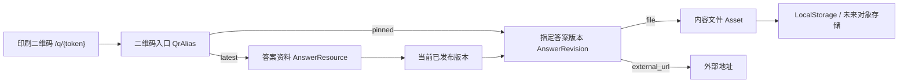

# 第四阶段后端解耦方案（评审稿）

状态：PROPOSED，尚未实施  
更新时间：2026-07-15

## 1. 结论摘要

推荐把现有“二维码绑定 + 资料信息 + 当前文件”拆成四层：

1. **二维码入口**：永久不变，只保存不可猜的公开代号。
2. **答案资料**：业务对象，例如“高一数学第一章答案”，名称可以修改。
3. **答案版本**：每次修改形成一个草稿版本，审核发布后才成为最新版。
4. **内容目标**：实际 PDF、图片或外部地址，属于某个具体版本。

新二维码只包含：

```text
http://192.168.100.20:18081/q/{public_token}
```

它不包含文件名、磁盘路径、最终 PDF 地址或数据库自增 ID。扫码先进入统一答案页，服务端在每次访问时解析当前已发布版本。因此改名、换文件、换外部地址、回滚版本都不需要重印二维码。

## 2. 当前系统已经具备的能力

当前动态入口 `/r/{qr_id}` 实际上已经能做到：

```text
qr_id -> bindings.current_version_id -> file_versions -> 物理文件
```

替换文件后，同一个二维码会读取新的 `current_version_id`。所以“同码访问最新版”的核心能力已经存在。

当前仍然耦合的部分是：

- `bindings` 同时承担二维码身份、资料业务信息和当前版本指针。
- `file_versions` 同时承担业务版本和物理文件记录。
- `/r/{qr_id}` 直接返回文件，缺少稳定的答案展示页。
- 上传新文件后立即切换当前版本，没有“草稿 -> 预览 -> 发布”过程。
- 当前版本只能是本地文件，不能统一表示外部地址或未来的其他内容类型。
- 一个二维码和一份资料天然是一对一，后续难以安全地重定向或复用资料。

## 3. 设计目标

- 二维码永久稳定，不因资料改名、文件替换或存储迁移而变化。
- 扫描同一个动态二维码始终看到最新的**已发布**答案。
- 支持 PDF、图片和外部网页地址，未来可增加富文本或视频。
- 上传或编辑先形成草稿，验证完成后原子发布，避免半成品立即对学生可见。
- 保留历史、回滚和固定版本二维码。
- 旧二维码继续可用，不要求重新印刷。
- 存储层可以从本地磁盘迁移到对象存储而不改变二维码和业务模型。

## 4. 非目标

本阶段不建议同时引入微服务、消息队列、Redis、对象存储或独立数据库。先在现有 FastAPI + SQLite + 本地存储中建立清晰边界，确认业务模型后再决定是否物理拆分服务。

## 5. 推荐架构



### 边界职责

| 层 | 负责 | 不负责 |
| --- | --- | --- |
| `QrAlias` | 永久入口、动态/固定策略、启停、指向哪份资料 | 文件名、存储路径、当前文件 |
| `AnswerResource` | 资料名称、年级、学科、章节、当前已发布版本 | 二维码图片、物理文件读写 |
| `AnswerRevision` | 版本号、草稿/发布状态、内容类型、变更说明 | 永久二维码身份 |
| `Asset` | 文件名、MIME、大小、SHA-256、存储键 | 哪个版本当前生效 |
| `StorageBackend` | 保存、读取、删除实际字节 | 业务发布和二维码解析 |

## 6. 数据模型

### `answer_resources`

```text
id                          INTEGER PK
resource_key                TEXT UNIQUE，不可猜的内部公开键
name                        TEXT，管理员可修改的资料名称
display_code                TEXT UNIQUE，人工搜索短编号
grade / subject / chapter   TEXT
textbook_version            TEXT
current_published_revision_id INTEGER NULL
status                      active / inactive / archived
row_version                 INTEGER，乐观锁
created_at / updated_at     TEXT
```

资料名称只用于展示和搜索，不参与二维码解析，也不要求唯一。

### `answer_revisions`

```text
id               INTEGER PK
revision_key     TEXT UNIQUE，不暴露自增 ID
resource_id      INTEGER FK
revision_number  INTEGER，同一资料内唯一递增
target_type      file / external_url
asset_id         INTEGER NULL FK
external_url     TEXT NULL
status           draft / published / retired
change_note      TEXT
created_at       TEXT
published_at     TEXT NULL
```

约束：

- `file` 必须有 `asset_id`，且没有 `external_url`。
- `external_url` 必须有合法地址，且没有 `asset_id`。
- `current_published_revision_id` 必须属于同一份资料并且状态为 `published`。
- 历史发布版本可以重新发布，不覆盖原记录。

### `assets`

```text
id                 INTEGER PK
asset_key          TEXT UNIQUE
storage_backend    TEXT，当前为 local
storage_key        TEXT UNIQUE
original_filename  TEXT
mime_type          TEXT
size_bytes         INTEGER
sha256             TEXT
created_at          TEXT
```

文件只新增、不原地覆盖。相同 SHA-256 是否去重可以后续决定，第一版不强制。

### `qr_aliases`

```text
id                  INTEGER PK
public_token        TEXT UNIQUE，不可猜且永久稳定
display_code        TEXT UNIQUE，人工识别
label               TEXT，可选的二维码用途名称
resource_id         INTEGER FK
resolve_mode        latest / pinned
pinned_revision_id  INTEGER NULL FK
status              active / inactive
created_at / updated_at TEXT
```

约束：

- `latest` 不允许设置 `pinned_revision_id`。
- `pinned` 必须指定属于同一资料的版本。
- 普通管理员不能直接修改 `public_token`。
- 重新指向另一份资料属于高风险操作，需要二次确认和审计记录。

### `audit_events`

第一版建议同时加入最小审计表：

```text
event_type, resource_id, revision_id, qr_alias_id,
actor, summary, created_at
```

至少记录创建草稿、发布、回滚、停用和重新绑定二维码。

## 7. 扫码解析流程

### 推荐默认体验

`GET /q/{public_token}` 返回移动端中文答案页，而不是直接返回 PDF 或 PNG。

页面显示：

- 答案资料名称。
- 当前版本号和更新时间。
- 内容预览或“查看答案”按钮。
- PDF、图片或外部地址的明确类型。
- 资料停用或暂无已发布版本时的中文提示。

页面每次请求都查询当前已发布版本：

```text
public_token
  -> qr_aliases
  -> answer_resources
  -> current_published_revision_id
  -> answer_revisions
  -> asset 或 external_url
```

### 内容打开入口

```text
GET /q/{public_token}/content
```

- 动态二维码：解析到资料当前已发布版本。
- 固定二维码：解析到 `pinned_revision_id`。
- 本地文件：临时跳转到不可变内容入口 `/content/{revision_key}`。
- 外部地址：使用 302/307 临时跳转，绝不使用永久 301。

不可变文件入口：

```text
GET /content/{revision_key}
```

它只负责读取某个确定版本的字节，不查询“最新版”。这样解析逻辑和文件传输逻辑完全分开。

## 8. 发布流程

推荐从当前“上传即生效”改为：

1. 管理员在资料详情中选择“新建答案版本”。
2. 上传 PDF/图片，或填写外部地址。
3. 系统校验文件、生成 SHA-256，并创建 `draft`。
4. 管理员预览草稿；学生二维码仍看到旧的已发布版本。
5. 管理员点击“发布此版本”。
6. 一个数据库事务中把草稿设为 `published`，同时更新 `current_published_revision_id`。
7. 事务提交后，同一个动态二维码立即显示新版。

如果上传或校验失败，不修改当前已发布版本。

### 回滚

回滚不是覆盖文件，而是把 `current_published_revision_id` 原子地指回一个历史发布版本，并写入审计事件。二维码保持不变。

### 并发保护

资料表增加 `row_version`。发布时使用：

```sql
UPDATE answer_resources
SET current_published_revision_id = ?, row_version = row_version + 1
WHERE id = ? AND row_version = ?;
```

更新行数为 0 时提示“资料已被其他管理员更新，请刷新后重试”，避免两个发布操作互相覆盖。

## 9. 缓存策略

动态解析入口必须避免旧答案被浏览器或代理长期缓存：

```text
/q/{token}           Cache-Control: no-store, must-revalidate
/q/{token}/content   Cache-Control: no-store, must-revalidate
```

不可变版本内容可长期缓存：

```text
/content/{revision_key}
Cache-Control: public, max-age=31536000, immutable
ETag: "{sha256}"
```

这样二维码解析始终取最新版，但确定版本的 PDF/图片可以高效缓存。

## 10. 外部地址规则

- 第一版只允许 `https://`；局域网测试可通过配置显式允许 `http://` 私有地址。
- 禁止 `file://`、`javascript:`、`data:` 和其他协议。
- 服务端第一版不主动抓取外部地址，避免 SSRF；只校验格式并在学生点击后跳转。
- 可选域名白名单应作为部署配置，不写死在业务数据里。
- 外部地址修改也创建新 revision，保留完整历史和回滚能力。

## 11. 兼容现有二维码

迁移必须保留现有 `qr_id` 和已印刷二维码：

1. 每条 `bindings` 创建一条 `answer_resources`。
2. 每条 `file_versions` 创建对应的 `assets` 和 `answer_revisions`。
3. `bindings.current_version_id` 转成 `current_published_revision_id`。
4. 每个现有 `qr_id` 创建 `qr_aliases.public_token`，值保持不变。
5. `version_references` 转换为固定二维码或 PDF job 对 revision 的保护引用。
6. `/r/{qr_id}` 保留为兼容入口，内部调用新 resolver 或 302 到 `/q/{qr_id}`。
7. 新生成的二维码改用 `/q/{public_token}`。
8. 现有固定版本入口继续可用，不改变其文件语义。

迁移前继续使用 SQLite backup API 生成完整备份；迁移必须幂等，并验证资料数、版本数、SHA-256 和旧二维码。

## 12. 服务代码边界

建议拆成以下应用服务，但仍在同一个 FastAPI 进程中：

```text
QrResolverService
  resolve(public_token) -> ResolvedAnswer

AnswerResourceService
  create / edit / deactivate / rebind

AnswerRevisionService
  create_draft / publish / rollback / list_history

AssetService
  validate / save / open / cleanup_unreferenced

StorageBackend
  LocalStorageBackend / future ObjectStorageBackend
```

路由层不再直接拼 SQL 或读取存储路径。`QrResolverService` 只返回结构化结果，不直接返回 `Path`；`AssetService` 再把确定 revision 转为文件响应。

## 13. 异常行为

| 场景 | 学生端行为 |
| --- | --- |
| 二维码不存在 | 404 中文页 |
| 二维码或资料停用 | 410 中文页 |
| 资料没有已发布版本 | 503/404 中文“答案暂未发布”页 |
| 当前 asset 丢失或校验失败 | 不自动切换；记录错误并显示中文维护提示 |
| 外部地址格式非法 | 禁止发布 |
| 外部站点自身不可用 | 显示返回入口，管理员后台可看到目标地址 |

发布新文件前应完成校验，因此不能让一个损坏草稿替换正常旧版本。

## 14. 管理页面调整

资料详情页建议分成：

- “当前已发布答案”：学生现在实际看到的内容。
- “草稿版本”：尚未对学生生效，可预览和发布。
- “历史版本”：可查看、重新发布或生成固定二维码。
- “二维码入口”：显示动态/固定方式和指向的资料，不显示物理路径。

按钮用语：

- “新建答案版本”
- “预览草稿”
- “发布此版本”
- “恢复为当前发布版本”
- “更改内容类型”

避免继续使用容易误解为直接覆盖文件的“替换文件”。

## 15. 分步实施建议

### 第一步：只拆数据层，保持现有行为

- 新建四层表和 migration。
- 迁移现有数据并双重校验。
- `/r/{qr_id}` 继续直接打开当前文件。
- 加入 service 单元测试，不改管理员操作习惯。

### 第二步：增加统一答案页和新入口

- 新增 `/q/{token}`、`/q/{token}/content` 和 `/content/{revision_key}`。
- 新二维码改用 `/q`。
- `/r` 作为兼容入口保留。

### 第三步：增加草稿和发布

- 新上传先成为草稿。
- 增加预览、发布、并发保护和审计。
- 回滚改为重新发布历史版本。

### 第四步：增加外部地址

- 增加 URL 校验和外部跳转。
- 根据实际部署决定 HTTPS、私有 HTTP 和域名白名单。

分步上线可以减少一次性 migration 和 UI 改动的风险。

## 16. 验收标准

1. 资料改名后二维码内容不变且仍可访问。
2. 上传草稿后，学生仍看到旧版本。
3. 发布后，同一动态二维码立即看到新版。
4. 回滚后，同一二维码看到选定历史版本。
5. 固定二维码在新版本发布后仍打开原版本。
6. PDF、图片和外部地址使用同一套 resolver。
7. 物理存储路径变化不影响二维码。
8. 旧 `/r/{qr_id}` 二维码全部继续工作。
9. 不存在、停用、未发布和内容丢失均有中文页面。
10. 动态入口无长期缓存，不可变版本带 SHA-256 ETag。
11. 两个管理员并发发布不会静默覆盖。
12. migration 幂等，原数据数量和 SHA-256 全部一致。
13. 匿名用户只能读学生入口，不能访问草稿和管理 API。
14. 同一局域网手机扫码可看到最新已发布答案。

## 17. 需要评审确认的产品选择

### A. 扫码后的默认体验

推荐：先打开统一答案页，显示名称、版本和更新时间，再预览或打开内容。  
备选：仍然直接打开当前 PDF/图片，但后端采用新 resolver。

### B. 是否允许外部地址

推荐：允许，但每次修改都形成版本；生产仅允许 HTTPS，局域网 HTTP 需要显式配置。

### C. 是否允许二维码改绑到另一份资料

推荐：技术上允许，普通管理员界面默认隐藏；需要二次确认和审计。错误改绑的影响等同于所有已印刷二维码内容被替换。

### D. 是否保留固定版本二维码

推荐：保留。动态二维码适合持续修订，固定二维码适合已经定稿的印刷内容。

### E. 谁可以发布

第一版可以由当前单管理员创建并发布；未来多账号后再拆分“编辑”和“审核发布”权限。

## 18. 推荐评审结论

建议批准以下最小范围：

1. 采用 `QrAlias -> AnswerResource -> AnswerRevision -> Asset/URL` 四层模型。
2. 新二维码使用 `/q/{public_token}`，默认打开统一答案页。
3. 保留动态和固定两种模式。
4. 引入草稿和显式发布，上传不再立即影响学生。
5. 保留旧 `/r` 入口，迁移不要求重新印刷二维码。
6. 第一轮先完成数据层、文件类型和发布流程；外部 URL 可作为下一小步上线。
